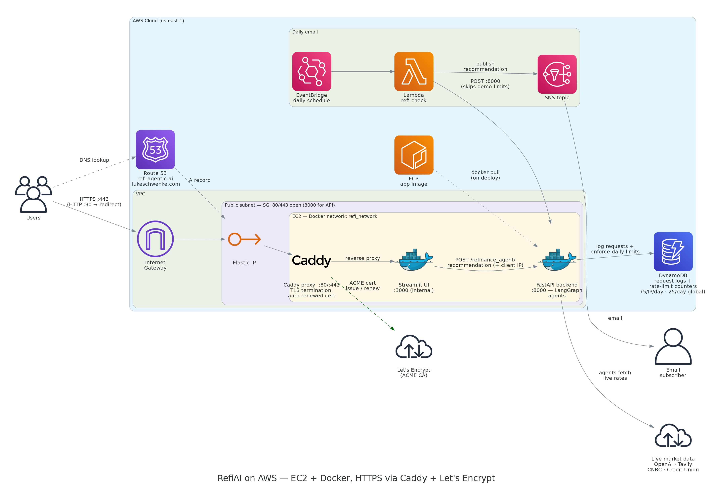

# Agentic Refinance Tool
### Author: Luke Schwenke

A multi-agent Python application that helps users evaluate whether refinancing a mortgage is financially beneficial. The system combines a FastAPI backend with a Streamlit UI and orchestrates multiple agents with LangGraph to retrieve live market context, calculate refinance break-even, and generate a natural-language recommendation. The LLM is OpenAI (model selected via the `OPENAI_MODEL_NAME` env var, e.g. *GPT-5* — not hardcoded).

**Try it out!:** https://refi-agentic-ai.lukeschwenke.com/

**API Docs (Swagger):** http://refi-agentic-ai.lukeschwenke.com:8000/docs

---

## Tech Stack

**Application**
- Python
- LangGraph (multi-agent orchestration)
- FastAPI + Uvicorn (REST API, OpenAPI/Swagger)
- Streamlit (interactive multi-page web UI)
- OpenAI (LLM, via LangChain)
- Tavily (live web search for current mortgage rates)

**Infrastructure & DevOps**
- Docker (containerized builds and runtime)
- Docker Compose (local orchestration)
- Poetry (dependency management)
- AWS EC2 (hosting)
- Amazon ECR (container registry)
- Elastic IP (static endpoint)
- Route 53 (custom domain + DNS)
- **Caddy** (reverse proxy + automatic HTTPS)
- **Let's Encrypt** (auto-issued/renewed TLS certificate)
- **Amazon DynamoDB** (request logging + rate-limit counters)
- **AWS Lambda + EventBridge + SNS** (scheduled daily email recommendation)

---

## High-Level Architecture



1. Users hit the custom domain over **HTTPS**; Route 53 resolves it to the EC2 Elastic IP.
2. A **Caddy** container terminates TLS (ports 80/443) and reverse-proxies to the Streamlit UI container over a private Docker network. HTTP is redirected to HTTPS, and the cert is auto-provisioned/renewed from Let's Encrypt.
3. Users enter mortgage details in the **Streamlit UI**, which calls the **FastAPI** backend (`POST /refinance_agent/recommendation`) on the internal Docker network, forwarding the visitor's IP for rate limiting.
4. FastAPI enforces the daily demo limits, then executes a **LangGraph** multi-agent workflow.
5. Agents retrieve live market data, perform break-even analysis, and return a recommendation.
6. Each request is logged to **DynamoDB**, and a daily **Lambda** (triggered by EventBridge) posts a fixed scenario to the API and publishes the result to an **SNS** email topic.

All three containers (Caddy, Streamlit UI, FastAPI backend) run on a single EC2 instance, connected via a shared Docker network (`refi_network`). The app image is built and pushed to **ECR**, then pulled on EC2 during deploy.

---

## HTTPS with Caddy

Instead of an ALB + ACM certificate (overkill for a single-instance personal project), TLS is handled by a lightweight **Caddy** reverse proxy running as a container on the EC2 host:

- Listens on ports **80 and 443**, redirecting HTTP → HTTPS.
- Automatically obtains and renews a free **Let's Encrypt** certificate for the domain (ACME HTTP-01 challenge).
- Reverse-proxies to the Streamlit UI container (`:3000`), which is **not** exposed on the host — all public traffic flows through Caddy.
- Certificates persist across redeploys in a Docker volume (`caddy_data`), avoiding Let's Encrypt rate limits.

This implements the standard "TLS-terminating reverse proxy in front of the app" pattern with near-zero certificate management.

> **Security group requirements:** inbound TCP **80** and **443** must be open. Port 80 is required for the ACME challenge and the HTTP→HTTPS redirect. The Route 53 record should point at a **stable Elastic IP** so cert renewal survives instance restarts.

---

## Rate Limiting

To bound worst-case OpenAI/Tavily spend on a publicly shared demo link, the FastAPI endpoint enforces two daily limits (resetting at midnight US/Eastern), backed by atomic counters in the existing DynamoDB table:

- **Per-IP limit:** 5 recommendations per visitor IP per day.
- **Global cap:** 25 recommendations per day across all visitors.

Behavior:
- Limits apply **only to UI traffic** (requests that carry a `client_ip`). The scheduled Lambda posts without one, so it can never be locked out.
- The per-IP limit is checked **first**, so a single blocked IP can't exhaust the global budget for everyone else.
- Exceeding either limit returns **HTTP 429** with a friendly message.
- If DynamoDB is unreachable, the limiter **fails open** rather than blocking visitors.

Counters are stored under keys like `ratelimit#<ip>#<date>` and `ratelimit#global#<date>` in the same `LOG_TABLE`, so no extra table is needed.

---

## Agents

Agent implementations live in `src/core/agents.py`. The guiding principle: **LLMs decide and explain; Python computes** — every number comes from deterministic code, and the LLM calls use structured outputs so their answers are guaranteed valid.

The workflow is a LangGraph `StateGraph`. It **short-circuits** when there's nothing to analyze (the market rate is higher than the user's rate, or live rates couldn't be retrieved), runs the two independent context fetches **in parallel**, and **self-checks** the final draft:

```
market ──> condition ──> unavailable OR rate already beats market: finalizer
                         else: (treasury_yield ‖ rate_outlook) -> calculator -> strategy -> finalizer
finalizer ──> verifier ──> pass: END   |   fail: finalizer (regenerate, max 1 retry)
```

`treasury_yield` and `rate_outlook` are independent, so they run as parallel branches (state merges via `operator.add` reducers on the `path`/`num_tool_calls` accumulators) and fan back in at the calculator.

### 1. Market Rate Agent
- Gathers both a **national average** rate (Tavily search, parsed deterministically) and a **DC-area local credit union** rate (scraped from its published rates).
- The lower available rate drives the analysis; both are reported to the user.

### 2. Treasury / Timing Agent
- Fetches the U.S. **10-year Treasury yield** plus its 52-week high/low and prior close.
- Derives relative timing signals: position within the 52-week range, day-over-day direction, and the mortgage-to-Treasury spread vs. the ~1.75% long-run norm. Framed as context, not a gate.
- Runs **in parallel** with the Rate Outlook agent.

### 3. Rate Outlook Agent
- Searches recent Fed/forecaster commentary and classifies the near-term direction of 30-year rates (**falling / stable / rising**) with a suggested posture (**act / wait / neutral**).

### 4. Calculator Agent
- Deterministically models several refinance structures — keep-your-payoff-date, 30-year reset, and 15-year — each with new payment, monthly savings, realistic closing costs (~2% default or the user's quote), break-even, **lifetime-interest change**, and whether it breaks even within the user's stay horizon.

### 5. Strategy Agent
- Reasons over those scenarios to recommend the best structure, explicitly weighing monthly savings against the lifetime-interest tradeoff (the "term-reset trap"); recommends *none* if nothing pencils out.

### 6. Finalizer Agent
- Loads its prompt from `src/prompts/finalizer_prompt.txt` and synthesizes the final, user-facing recommendation. All numbers and the verdict branch are precomputed and pre-formatted in Python — the LLM only narrates.

### 7. Verifier Agent (LLM-as-judge)
- The finalizer is the only node that emits free-form text with numbers, so a second (cheaper) model fact-checks its draft against the computed values and the precomputed verdict. On a mismatch it sends the draft back to the finalizer **once** with the specific complaint (an evaluator-optimizer loop, bounded to one retry); it fails *open* so a checker error never blocks the user.

External fetches (CNBC, the credit union page, Tavily) are retried with backoff and cached for ~15 minutes, and a request that finds no usable market rate degrades to an honest "couldn't retrieve live rates" response instead of a fabricated analysis.

---

## API

**Base URL**
- `http://<host>:8000`

**Swagger / OpenAPI**
- `http://<host>:8000/docs`

**Recommendation Endpoint**
- `POST /refinance_agent/recommendation`

Example request (only the first three fields are required — the rest default sensibly):
```json
{
  "interest_rate": 6.5,
  "current_payment": 5243.26,
  "mortgage_balance": 768000,
  "client_ip": "203.0.113.42",
  "remaining_term_years": 22,
  "stay_horizon_years": 7,
  "closing_costs": 12000
}
```

`client_ip` is optional — the Streamlit UI sends the visitor's IP (from the `X-Forwarded-For` header set by Caddy) so the API can enforce per-IP limits. Requests without it (e.g. the scheduled Lambda) skip rate limiting.

Example response (abridged):
```json
{
  "recommendation": "**Refinancing looks worthwhile.** ...",
  "market_rate": 5.875,
  "treasury_yield": 4.21,
  "num_tool_calls": 4,
  "path": ["market_expert_agent", "treasury_yield_agent", "rate_outlook_agent",
           "calculator_agent", "strategy_agent", "finalizer_agent", "verifier_agent"],
  "verifier_passed": true,
  "new_payment": 4892.10,
  "monthly_savings": 351.16,
  "break_even": 14.2,
  "scenarios": [{"label": "Keep your current payoff date", "...": "..."}],
  "recommended_scenario_label": "Keep your current payoff date",
  "lifetime_interest_delta": -127248.78,
  "rate_outlook_label": "stable",
  "rate_outlook_summary": "Rates are expected to hold mostly steady...",
  "rate_outlook_action": "neutral"
}
```

---

## UI

The Streamlit app is multi-page (sidebar navigation):

- **RefiAI Main Page** — enter mortgage details and get a recommendation.
- **Agent Workflow Details** — visualizes the LangGraph workflow and describes each agent.
- **Architecture Diagram** — the AWS infrastructure diagram.
- **Project Inspiration** — background and the daily-email feature.

Shared theming (the dark-emerald look, decorative palm trees, and the legal footer) lives in `src/frontend/ui.py` and is applied on every page.

---

## Environment

A `.env` file (gitignored) is required and read by both the app and Docker. Keys used in code:

| Variable | Purpose |
|---|---|
| `OPENAI_API_KEY` | OpenAI authentication |
| `OPENAI_MODEL_NAME` | Which OpenAI model to use (not hardcoded) |
| `TAVILY_API_KEY` | Tavily web search |
| `LOG_TABLE` | DynamoDB table for request logs + rate-limit counters |
| `AWS_REGION` | AWS region (default `us-east-1`) |
| `LOCAL_CREDIT_UNION_RATES_URL` | DC-area credit union "featured rates" endpoint (degrades to unavailable if unset) |
| `API_BASE_URL` / `API_PORT` / `API_PATH` | Client-side API URL construction |

---

## Local Development

Dependencies are managed with Poetry. Common `make` targets:

```bash
make build      # build the API Docker image (linux/amd64)
make run        # run the API container, reading .env, on port 8000
make ui         # run the Streamlit UI locally
make go         # build + run + ui
make rebuild    # stop + build + run + ui
make stop       # stop & remove the container
```

Run the API directly without Docker:
```bash
poetry run uvicorn api.api_setup:app --host 127.0.0.1 --port 8000 --reload
```

Run tests (some hit live endpoints and need network access + `TAVILY_API_KEY`):
```bash
poetry run pytest
poetry run pytest tests/test_tools.py -m treasury -s
```

---

## Deployment

The app is deployed to EC2 via ECR:

```bash
make push-ecr            # build & push the image to ECR
make full-deploy-prod    # push to ECR, then pull & restart containers on EC2
```

`full-deploy-prod` connects to the EC2 instance, pulls the latest image, and (re)starts the FastAPI backend, Streamlit UI, and Caddy proxy containers on the shared Docker network. Regenerate the architecture diagram with `python docs/generate_arch_diagram.py` (requires the `diagrams` package and Graphviz).

---

> **Disclaimer:** RefiAI is a personal demo project for educational purposes. It does not provide financial, legal, or tax advice, and nothing in it is a loan offer or commitment to lend.
